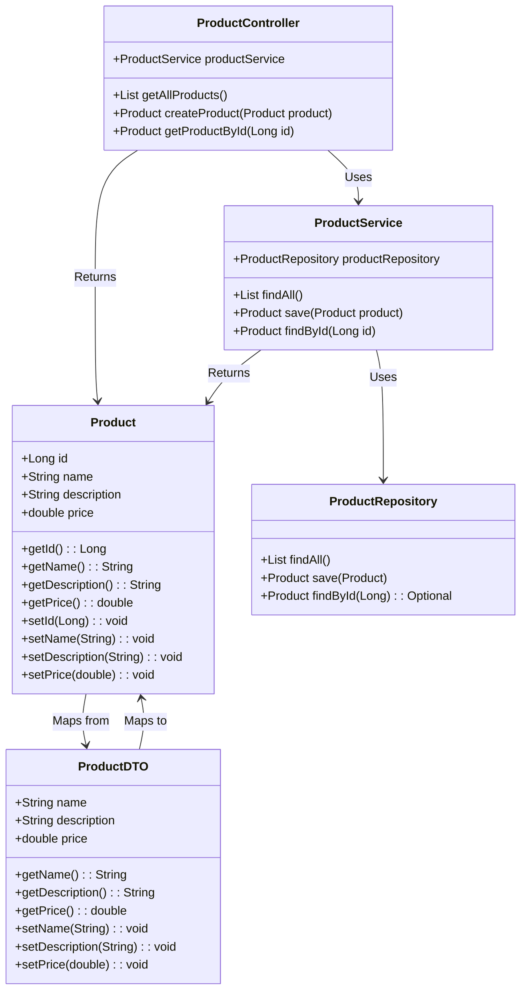

# Ecommerce-API

Java RESTful API criada para a Testar os conhecimentos aprendidos no Decola Tech 2025, como base do projeto utilizei o repositório:
### [digitalinnovationone/santander-dev-week-2023-api](https://github.com/digitalinnovationone/santander-dev-week-2023-api)

Fiz algumas alterções, como mudar as camdadas de negocio para um pequeno E-commerce, fazendo a crianção so de cadastro de produtos.

## Principais Tecnologias
 - **Java 21**: Utilizaremos a versão LTS mais recente do Java para tirar vantagem das últimas inovações que essa linguagem robusta e amplamente utilizada oferece;
 - **Spring Boot 3**: Trabalharemos com a mais nova versão do Spring Boot, que maximiza a produtividade do desenvolvedor por meio de sua poderosa premissa de autoconfiguração;
 - **Spring Data JPA**: Exploraremos como essa ferramenta pode simplificar nossa camada de acesso aos dados, facilitando a integração com bancos de dados SQL;
 - **OpenAPI (Swagger)**: Vamos criar uma documentação de API eficaz e fácil de entender usando a OpenAPI (Swagger), perfeitamente alinhada com a alta produtividade que o Spring Boot oferece;

## Diagrama de Classes

