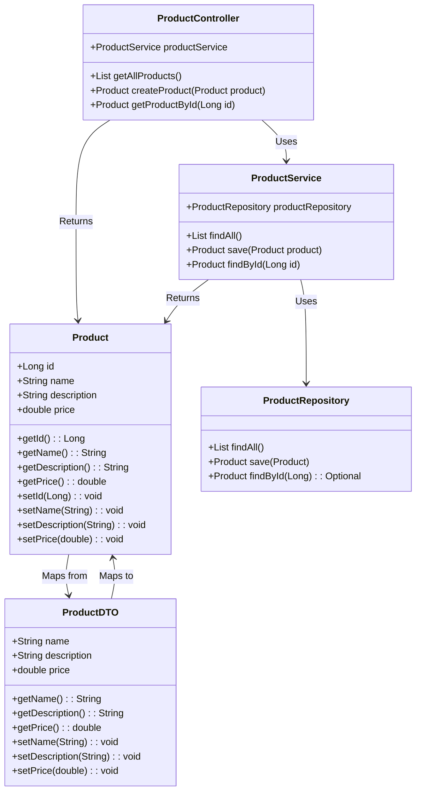

#Ecommerce-API

## Diagrama de Classes

```mermaid
classDiagram
    class Product {
        +Long id
        +String name
        +String description
        +double price
        +getId() : Long
        +getName() : String
        +getDescription() : String
        +getPrice() : double
        +setId(Long) : void
        +setName(String) : void
        +setDescription(String) : void
        +setPrice(double) : void
    }

    class ProductDTO {
        +String name
        +String description
        +double price
        +getName() : String
        +getDescription() : String
        +getPrice() : double
        +setName(String) : void
        +setDescription(String) : void
        +setPrice(double) : void
    }

    class ProductRepository {
        +List<Product> findAll()
        +Product save(Product)
        +Product findById(Long) : Optional<Product>
    }

    class ProductService {
        +ProductRepository productRepository
        +List<Product> findAll()
        +Product save(Product product)
        +Product findById(Long id)
    }

    class ProductController {
        +ProductService productService
        +List<Product> getAllProducts()
        +Product createProduct(Product product)
        +Product getProductById(Long id)
    }

    ProductController --> ProductService : Uses
    ProductService --> ProductRepository : Uses
    ProductController --> Product : Returns
    ProductService --> Product : Returns
    ProductDTO --> Product : Maps to
    Product --> ProductDTO : Maps from
```
